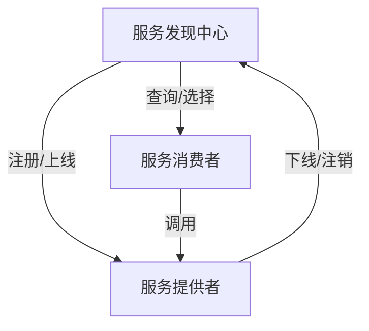
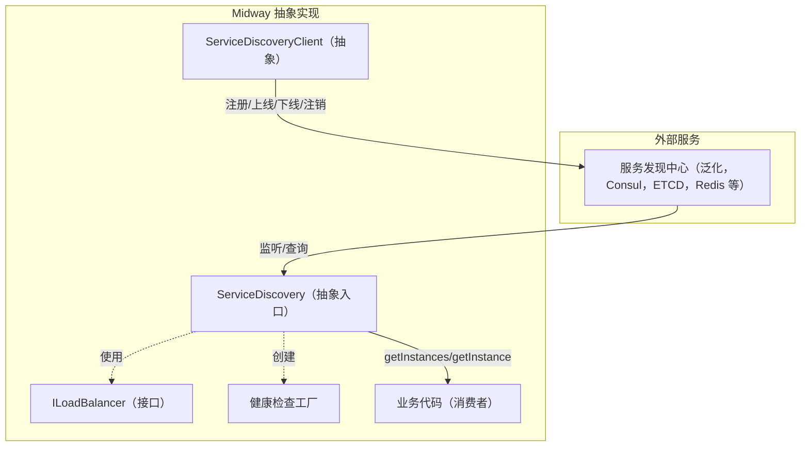

# 服务发现（Service Discovery）

在分布式架构中，服务发现用于自动注册和发现可用的服务实例，并通过健康检查与负载均衡确保调用的稳定与高可用。Midway 在核心层提供了统一的抽象与基类，并在不同的注册中心上提供了具体实现（Consul、ETCD、Redis），以适配多种使用场景。


## 基本概念与抽象

服务发现是指在分布式系统中，服务消费者能够自动发现并调用服务提供者的实例。它通常包括以下几个组件：

- 服务提供者（Service Provider）：注册自身实例到服务发现中心，保持实例状态（如健康、可用）。
- 服务发现中心（Service Registry）：负责存储服务提供者的实例信息，提供查询接口。
- 服务消费者（Service Consumer）：通过服务发现中心查询可用实例，根据负载均衡策略选择实例调用。
- 负载均衡器（LoadBalancer）：在服务消费者端，根据策略（如轮询、随机）选择实例进行调用。
- 健康检查（Health Check）：服务发现中心定时检查实例状态，确保调用的实例是健康的。



Midway 基于业界的基本概念，抽象了服务发现的基本组件，包括服务提供者、服务发现中心、服务消费者、负载均衡器与健康检查。




### 抽象与扩展点

- ServiceDiscoveryClient（面向注册中心的客户端基类）
  - 负责实例生命周期：`register`、`deregister`、`online`、`offline`、`beforeStop`。
  - 提供 `defaultMeta`（包含默认实例信息）与 `getSelfInstance` 获取已注册实例。
  - 封装 `stop`：先执行 `beforeStop`，再自动调用 `deregister` 清理资源。
  - 使用泛型指定：底层 Client 类型、配置选项、注册实例类型与查询实例类型。

- ServiceDiscovery（统一入口类）
  - 创建客户端：`createClient(options?)` 合并默认配置与覆盖项，并记录在内部存储中。
  - 查询实例：`getInstances(options)` 返回候选集合；`getInstance(options)` 结合负载均衡选择单个实例。
  - 负载均衡：`setLoadBalancer(type|impl)` 设置策略或注入自定义实现，默认轮询。
  - 生命周期：`destroy` 会先调用自身的 `beforeStop`，再逐一停止并注销所有已创建客户端。
  - 扩展方法需实现：`getServiceClient`、`createServiceDiscoverClientImpl`、`getDefaultServiceDiscoveryOptions`、`getInstances`。

- 负载均衡（ILoadBalancer 与工厂）
  - 接口：`select(instances)` 根据策略返回一个实例。
  - 内置策略：`RANDOM`（随机）、`ROUND_ROBIN`（轮询）。
  - 自定义：实现 `ILoadBalancer` 并通过 `setLoadBalancer(customImpl)` 注入。

- 健康检查（IServiceDiscoveryHealthCheck 与工厂）
  - 基类 `AbstractHealthCheck` 提供检查节流与最近结果记录：`shouldCheck()`、`getLastCheckResult()`。
  - 工厂创建：`ttl`、`http`、`tcp`、`self`、`custom`；不同类型适用于不同场景（如 TTL 适配键值 TTL 刷新模式，HTTP/TCP 适配网络探活）。


## 逐步实现一个服务发现

以下以核心抽象为基础，分步骤说明如何实现一个新的服务发现能力。

### 第 1 步：定义类型

- 定义注册实例与配置选项类型，约定必要字段（如 `serviceName/id/meta/ttl`）。

```typescript
type MyRegisterInstance = {
  serviceName: string;
  id: string;
  ttl?: number;
  meta?: Record<string, string>;
};

type MyOptions = {
  ttl?: number;
  loadBalancer?: any;
};
```

### 第 2 步：实现客户端基类

- 继承 `ServiceDiscoveryClient`，落地注册中心的具体交互与状态切换。

```typescript
class MyServiceDiscoverClient extends ServiceDiscoveryClient<any, MyOptions, MyRegisterInstance> {
  async register(instance: MyRegisterInstance): Promise<void> {
    this.instance = instance;
  }
  async deregister(): Promise<void> {}
  async online(): Promise<void> {}
  async offline(): Promise<void> {}
  async beforeStop(): Promise<void> {}
}
```

要点：
- `register` 持有实例并完成注册中心写入。
- `online`/`offline` 切换可用状态（如键写入与删除、心跳管理）。
- `deregister` 注销实例并清理资源。
- `beforeStop` 用于停止心跳、订阅、定时器等。

### 第 3 步：实现统一入口类

- 继承 `ServiceDiscovery`，将客户端与负载均衡整合为统一入口。

```typescript
class MyServiceDiscovery extends ServiceDiscovery<any, MyOptions, MyRegisterInstance, MyRegisterInstance, string> {
  protected getServiceClient() { return {}; }
  protected createServiceDiscoverClientImpl(options: MyOptions) {
    return new MyServiceDiscoverClient(this.getServiceClient(), options);
  }
  protected getDefaultServiceDiscoveryOptions(): MyOptions { return { ttl: 30 }; }
  public async getInstances(serviceName: string): Promise<MyRegisterInstance[]> { return []; }
}
```

要点：
- `createClient` 自动合并默认配置与覆盖项，统一创建客户端。
- `getInstances` 返回候选集合，供负载均衡选择。
- `getInstance` 内部按策略选择一个实例。

### 第 4 步：配置与使用

- 创建客户端，注册并获取实例。

```typescript
const discovery = await container.getAsync(MyServiceDiscovery);
const client = discovery.createClient({ ttl: 20 });
await client.register({ serviceName: 'order', id: 'order-1' });
const instances = await discovery.getInstances('order');
const one = await discovery.getInstance('order');
```

### 第 5 步：设置负载均衡

- 使用内置策略或注入自定义实现。

```typescript
import { LoadBalancerType } from '@midwayjs/core';
discovery.setLoadBalancer(LoadBalancerType.ROUND_ROBIN);
```

### 第 6 步：集成健康检查（可选）

- 按需选择 `ttl/http/tcp/custom` 类型，并在上线或周期任务中使用。

```typescript
import { ServiceDiscoveryHealthCheckFactory } from '@midwayjs/core';
const check = ServiceDiscoveryHealthCheckFactory.create('http', { url: 'http://127.0.0.1:7001/health' });
const result = await check.check({});
```

### 第 7 步：生命周期清理

- 容器销毁时，入口类会调用所有客户端的 `stop`，确保注销与资源回收。


## 获取实例与负载均衡

所有实现均遵循统一的接口：

```typescript
// 获取所有可用实例
await serviceDiscovery.getInstances(/* 参见具体实现签名 */);

// 获取一个实例（带负载均衡）
await serviceDiscovery.getInstance(/* 参见具体实现签名 */);

// 设置负载均衡策略
serviceDiscovery.setLoadBalancer(LoadBalancerType.RANDOM);
```


## 生命周期与清理

- 在容器销毁时，`ServiceDiscovery` 会调用所有 `ServiceDiscoveryClient.stop()` 完成注销与资源回收。
- 各实现均在 `beforeStop` 中完成健康检查、订阅、租约等资源的关闭。


## 类型定义与扩展

- 服务发现配置使用 `ServiceDiscoveryOptions<T>`，在各实现中可扩展（例如 ETCD 的 `ttl/namespace`、Redis 的 `prefix/scanCount`、Consul 的 `autoHealthCheck`）。
- 可通过实现自定义的 `ILoadBalancer` 或健康检查来扩展行为。


## 小结

服务发现以统一抽象组织：入口类负责客户端创建与负载均衡选择，客户端负责注册中心适配与实例生命周期管理。使用时仅需：创建客户端 → 注册并上线 → 通过入口类获取实例列表或单个实例（可设置负载均衡策略）→ 生命周期结束自动清理。
